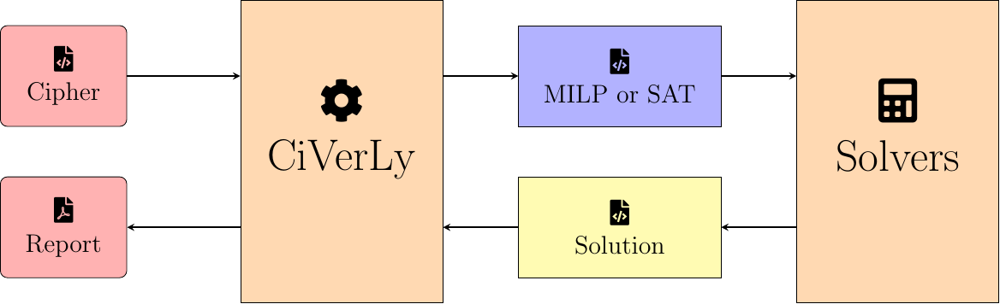

# Welcome to CiVerLy — The Cipher Verification Library

## Overview

CiVerLy helps you analyze primitives from symmetric cryptography.



First, implement the cipher in the format CiVerLy expects. CiVerLy can then automatically apply methods from the academic literature to generate mixed-integer linear programming (MILP) or satisfiability (SAT) models that describe the linear or differential properties of the cipher. Solving these models produces linear or differential trails, which allow you to assess the security of the primitive. Check out the [ciphers already implemented in CiVerLy](src/civerly/cipher_implementations/) for examples.

CiVerLy is built on [SageMath](https://www.sagemath.org/) and is intentionally modular. For example, model generation and solving are separable, so they can run on different machines. The modular design also makes it easy to extend CiVerLy (for instance, to integrate additional cryptographic techniques).

This project was developed by [cryptosolutions GmbH](https://cryptosolutions.de/) on behalf of the [German Federal Office for Information Security (BSI)](https://www.bsi.bund.de). 
As part of the effort to strengthen IT security, CiVerLy has been released as open-source software and made freely available to the scientific community.
cryptosolutions GmbH now continues to develop and maintain the project.

## Documentation

The full documentation is available at [docs.civerly.cryptosolutions.de](https://docs.civerly.cryptosolutions.de).

## Installation

To install CiVerLy, simply run:
```
sage -pip install git+https://github.com/kryptoloesungen/CiVerLy
```

We also have prebuilt docker images and AppImages which come with solvers included. Check out the [documentation](https://docs.civerly.cryptosolutions.de/installation/civerly.html) for more information.

## License
This project is licensed under the EUROPEAN UNION PUBLIC LICENCE v. 1.2 (EUPL 1.2) with an additional non-endorsement clause; see [LICENSE](LICENSE) for details.
