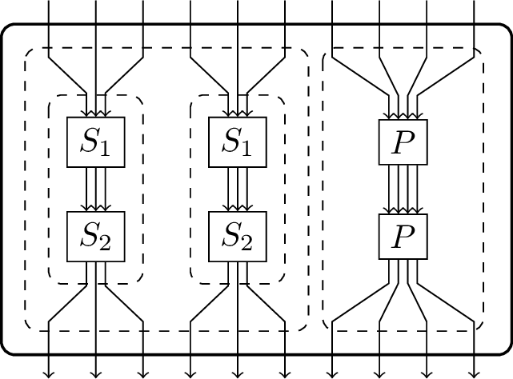
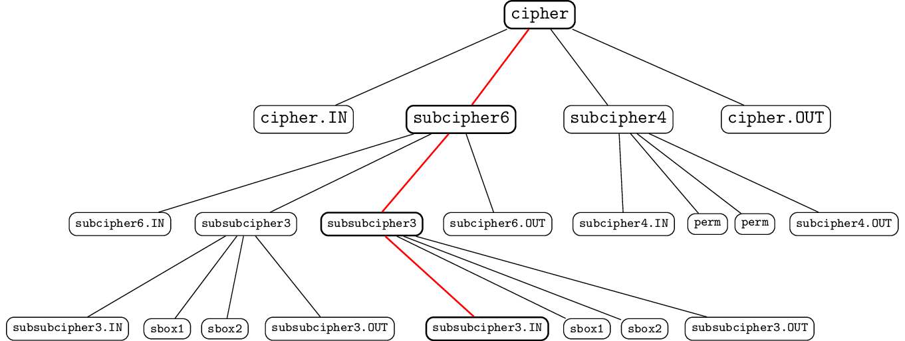
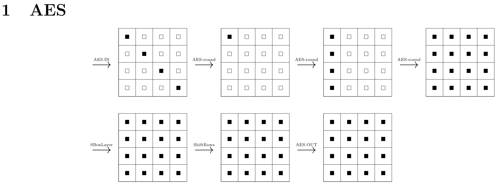
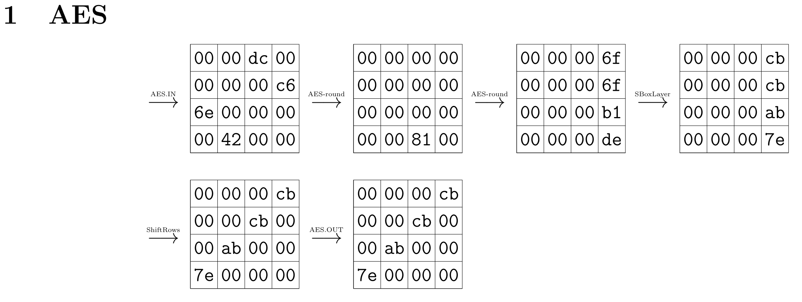
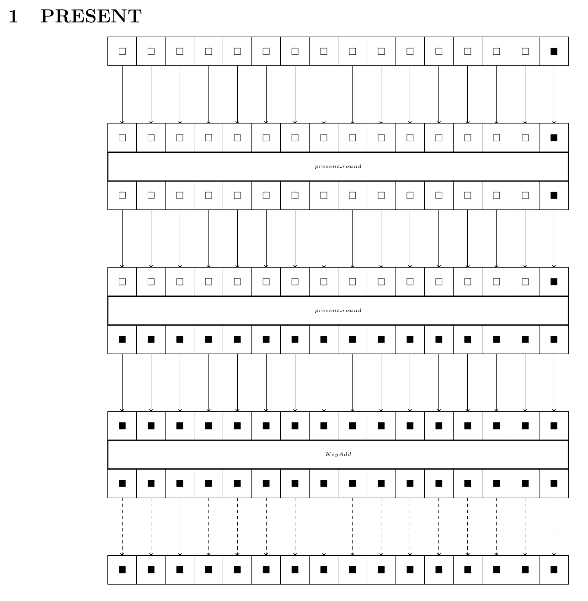
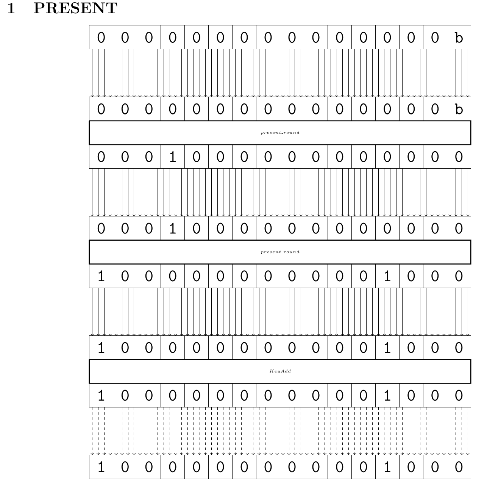

=====================
Generating the Report
=====================

The solution files generated by solvers contain all the necessary information for the analysis of ciphers, namely both the optimal bound as well as the variable assignments responsible for that bound.
%
Depending on the specific goal of the CiVerLy user, the optimal bound might give sufficient information about the analysed cipher already.
In that case, the optimal bound may be read off directly from the solution file, or it may be extracted via the ``_process_solution_file`` method from ``util.py``.

However, often the actual details of this analysis are of interest to the user, in particular what the activity pattern or trail that yields the given bound actually looks like.
In this case it is virtually impossible to gain any direct insight about the underlying cryptographic problem from the solution file, as MILP and SAT modeling are both major steps of abstraction.
To help with this, CiVerLy supports two ways of visualizing the trail, either by showing the trail in text form or by generating a PDF-report.

First observe that ciphers are represented as recursive DAGs in ``CiVerLy``.
In order to introduce some further structure, we construct a grid of all components based on their depth inside the cipher, which is assigned via Depth-First-Search, where the depth assigned to each subcipher is the maximum number of nodes needed to go from ``cipher.IN`` to it.

In this way, even ciphers with a non-standard structure can be represented in a somewhat readable way, while the approach is kept as generic as possible.

Then, we display the input and output of each component or subcipher in the report as well the input and output of the cipher itself.
If the cipher consists of subciphers, which in turn are cipher objects, we must display the propagation of the found trail inside each of the subciphers too.
This is done recursively, by building up a tree structure of the subciphers and components, and subsequently using Breadth-First-Search to determine a fitting node ordering.

Note that a priori, the internal structure of each subcipher is ignored, as only the input and output variables are displayed, while the other variables (possibly associated to components inside the subcipher) are treated as dummy variables with no particular meaning regarding the cipher structure.
However, when the subcipher itself is modeled, we need to translate all the previously ignored variables correctly, as now they do in fact resemble the subciphers structure.
In order to achieve this, CiVerLy generates translation dictionaries during the modeling step, one for each non-trivial subcipher.
These dictionaries are stored as json files and will be applied during the report generation.

This process is best illustrated by an example, for which we consider the toy cipher depicted below.
It is intentional that this cipher uses several iterations of subciphers, so that this example becomes more clear, as its report generation will require multiple recursion steps.

   A toy cipher with several subciphers.

A possible implementation of it is given below.

.. code-block:: sage

   sage: from civerly.sboxcipher import SBoxCipher
   sage: from civerly.component import PermuteLayer_CVL, SBox_CVL
   sage: from sage.crypto.sbox import SBox
   sage: cipher = SBoxCipher(10, 10, name="cipher")
   sage: subcipher6 = SBoxCipher(6, 6, name="sub-cipher-6-bit")
   sage: subcipher3 = SBoxCipher(3, 3, name="sub-sub-cipher-3-bit")
   sage: subcipher4 = SBoxCipher(4, 4, name="sub-cipher-4-bit")
   sage: sbox1 = SBox_CVL(SBox([0, 7, 3, 5, 1, 2, 6, 4]), name="sbox1")
   sage: sbox2 = SBox_CVL(SBox([4, 2, 1, 7, 0, 3, 5, 6]), name="sbox2")
   sage: perm = PermuteLayer_CVL([0, 3, 1, 2], name="perm")
   sage: node = subcipher3.add_subcipher(
   ....:   sbox1, [(subcipher3.IN, (i, i)) for i in range(3)])
   sage: node = subcipher3.add_subcipher(sbox2, [(node, (i, i)) for i in range(3)])
   sage: subcipher3.add_output([(node, (i, i)) for i in range(3)])
   sage: node1 = subcipher6.add_subcipher(
   ....:   subcipher3, [(subcipher6.IN, (i, i)) for i in range(3)])
   sage: node2 = subcipher6.add_subcipher(
   ....:   subcipher3, [(subcipher6.IN, (i + 3, i)) for i in range(3)])
   sage: subcipher6.add_output([(node1, (i, i)) for i in range(3)])
   sage: subcipher6.add_output([(node2, (i, i + 3)) for i in range(3)])
   sage: node = subcipher4.add_subcipher(perm, [(subcipher4.IN, (i, i)) for i in range(4)])
   sage: node = subcipher4.add_subcipher(perm, [(node, (i, i)) for i in range(4)])
   sage: subcipher4.add_output([(node, (i, i)) for i in range(4)])
   sage: node1 = cipher.add_subcipher(
   ....:   subcipher6, [(cipher.IN, (i, i)) for i in range(6)])
   sage: node2 = cipher.add_subcipher(
   ....:   subcipher4, [(cipher.IN, (i + 6, i)) for i in range(4)])
   sage: cipher.add_output([(node1, (i, i)) for i in range(6)])
   sage: cipher.add_output([(node2, (i, i + 6)) for i in range(4)])

First, we analyse the toy cipher:

.. link

.. code-block:: sage

   sage: from civerly.model_options import *
   sage: from pathlib import Path
   sage: model_options = MODEL_OPTIONS(
   ....:   cryptanalysis=CRYPTANALYSIS.DIFFERENTIAL,
   ....:   optimization=OPTIMIZATION.MILP,
   ....:   granularity=GRANULARITY.BITWISE,
   ....:   sbox_modeling=SBOX_MODELING.LOGICAL_COND,
   ....:   milp_solver=SOLVER.SCIP,
   ....:   path=Path("./CVL-Example"))
   sage: cipher.analyse(model_options) # optional: scip
   206 variables and 1711 constraints were written to 'CVL-Example/cipher.mps'
   0

As we have thereby also modeled the cipher, we see below that (next to the ``.mps``, ``.sol`` and ``.log`` files) CiVerLy generated json files containing the corresponding dictionaries.
Notice that files named ``<name>_d.json`` contain the dictionaries, while files of the form ``<name>_id.json`` contain their inverses, which are sometimes necessary when the key of a specific value must be found.

.. skip

.. code-block:: text

   Example
   ├── cipher_d.json
   ├── cipher_id.json
   ├── cipher_SCIP.log
   ├── cipher.mps
   ├── cipher.sol
   ├── sub-cipher-4-bit_d.json
   ├── sub-cipher-4-bit_id.json
   ├── sub-cipher-6-bit_d.json
   ├── sub-cipher-6-bit_id.json
   ├── sub-sub-cipher-3-bit_d.json
   └── sub-sub-cipher-3-bit_id.json

Let us inspect the content of ``cipher_d.json`` more closely, to give a better intuition for how to understand the structure of these dictionaries.

.. skip

.. code-block:: text

   [
   { # dictionary for cipher.IN (cipher.complist[0])
       "X0[0]": "OUT[0]", "X0[1]": "IN[0]", "X0[2]": "OUT[1]",
       "X0[3]": "IN[1]", "X0[4]": "OUT[2]", "X0[5]": "IN[2]",
       "X0[6]": "OUT[3]", "X0[7]": "IN[3]", "X0[8]": "OUT[4]",
       "X0[9]": "IN[4]", "X0[10]": "OUT[5]", "X0[11]": "IN[5]",
       "X0[12]": "OUT[6]", "X0[13]": "IN[6]", "X0[14]": "OUT[7]",
       "X0[15]": "IN[7]", "X0[16]": "OUT[8]", "X0[17]": "IN[8]",
       "X0[18]": "OUT[9]", "X0[19]": "IN[9]"
   },
   # dictionary for subcipher6 (cipher.complist[1])
   {"X1[0]": "X0[1]", "X1[1]": "X0[0]", ..., "X1[61]": "X3[3]", ...},
   # dictionary for cipher.OUT (cipher.complist[2])
   {"X2[0]": "OUT[0]", "X2[1]": "IN[0]", ...},
   # dictionary for subcipher4 (cipher.complist[3])
   {"X3[0]": "X0[1]", "X3[1]": "X0[0]", ...}
   ]

From this (and checking ``cipher.complist`` for the DFS ordering of the nodes) we can deduce the variable assignments, e.g. we see that ``X0[0]`` resembles the 0th output bit of the ``cipher.IN`` component, or that ``X2[1]`` corresponds to the 0th input bit of ``cipher.OUT``, etc.
As mentioned above, this works recursively too.
Consider the variable ``X1[61]`` on the level of ``cipher_d``.
Inside ``cipher.complist[1] = sub-cipher-6-bit``, this translates to ``X3[3]``.
We continue this process by investigating the file ``sub-cipher-6-bit_d.json``, which contains

.. skip

.. code-block:: text

   [..., {..., "X3[3]": "X0[2]", ...}, ...]

As ``cipher.complist[1].complist[3] = sub-sub-cipher-3-bit`` (the second one), we continue by analysing ``sub-sub-cipher-3-bit_d.json`` and see

.. skip

.. code-block:: text

   [..., {..., "X0[2]": "OUT[1]", ...}, ...]

We may finally check that ``cipher.complist[1].complist[3].complist[0] = sub-sub-cipher-3-bit.IN`` to conclude our search and learn that the variable ``X1[61]`` on the level of ``cipher`` translates to the first output node of the ``IN`` node inside the second ``sub-sub-cipher-3-bit`` subcipher inside the ``sub-cipher-6-bit`` subcipher.

Notice how we recursively iterated through a tree-like structure, where the root node is ``cipher`` and the children of each node are the subciphers of the corresponding cipher.
For our example, the tree structure is depicted below.

   The tree structure arising from the toy cipher. The node names are shortened for enhanced readability. Red: The traversed path through each dictionary, as explained above.

Note that this tree (intentionally) contains redundant information, as the activity pattern (i.e. difference or linear mask, respectively) in any subcipher is the same as in its respective ``.IN`` node. Furthermore, its ``.OUT`` node must contain the same activity pattern as the ``.IN`` node of the subsequent subcipher.
For our example, this means that ``cipher`` and ``cipher.IN`` share the same activity pattern, just like ``subcipher6.OUT``, ``subcipher4`` and ``subcipher4.IN`` share the same value as well.

Text
----

Now, in regards to the tree structure explained above, calling the method ``get_trail`` simply returns the nodes in the order of a Depth-First-Search traversal, with whitespace indicating the depth of the current node inside the tree.

.. link

.. code-block:: sage

   sage: cipher.get_trail(model_options) # optional: scip
   -> cipher : 00f -> 00f
      -> sub-cipher-6-bit : 00 -> 00
         -> sub-sub-cipher-3-bit : 0 -> 0
         -> sub-sub-cipher-3-bit : 0 -> 0
      -> sub-cipher-4-bit : f -> f

.. code-block:: sage
   :hide:

   sage: import shutil
   sage: shutil.rmtree("./CVL-Example") # optional: scip

PDF
---

The tree structure is also utilized to generate the PDF report, however by iterating in a Breadth-First order.
Concretely, CiVerLy generates a LaTeX document, of which the first section contains a TikZ-picture of how the trail propagates on the root level.
In our example, the components ``cipher.IN``, ``subcipher6``, ``subcipher4`` and ``cipher.OUT`` are displayed in section one of the PDF report.
Note that here, the ordering of subciphers is based on DFS, however using the grid-like structure created during the report generation.
That is, the depth assigned to each subcipher is the maximum number of nodes needed to go from ``cipher.IN`` to it, and not the number of nested subciphers it is contained in.

As such a high level description of the trail is often not sufficient, we now iterate this recursively for each subcipher and their respective subciphers etc., as done for the text-based report.
Therefore, the second section displays the propagation through ``sub-cipher-6-bit``, then for ``sub-sub-cipher-3-bit``, etc.

Since the PDF report allows for more customization than the text-based report, we differentiated between the following display options, which are derived from the cipher type as well as the modeling options:

Wordwise Modeling of AESlike Ciphers
^^^^^^^^^^^^^^^^^^^^^^^^^^^^^^^^^^^^

The solutions of wordwise models contain assignments to whether a word is active or not, without specifying the concrete difference value (or linear mask).
Therefore, there are only two options for each word.
When a word is inactive, it will be marked with white square, while being marked
with a black square if it is active.

Furthermore, CiVerLy also respects that AESlike ciphers operate on rectangular states and aligns the state accordingly.
An example of such a report is the one generated from wordwise modeling of the AES, as shown below.

Bitwise Modeling of AESlike Ciphers
^^^^^^^^^^^^^^^^^^^^^^^^^^^^^^^^^^^

For bitwise models, the assignments of each word now contain any values of bitlength ``wordsize``.
If no ``wordsize`` was specified, it is defaulted to 4, in order to display nibbles.

To display these, the variables representing each bit are stored into a similar list as for the wordwise modeling.
Then, these bits are combined into groups of the correct wordsize to display the words.

Again, for AESlike ciphers the rectangular state is displayed accordingly.
An example of such a report is the one generated from bitwise modeling of the AES, as shown below.

Wordwise Modeling of general Ciphers
^^^^^^^^^^^^^^^^^^^^^^^^^^^^^^^^^^^^

Analogously, a report resulting from wordwise modeling of ciphers that are not AESlike (but rather ``WordSBoxCipher`` objects, as these are the only ciphers without a rectangular state which support wordwise modeling) looks as follows:

Bitwise Modeling of general Ciphers
^^^^^^^^^^^^^^^^^^^^^^^^^^^^^^^^^^^

Finally, the report from bitwise modeling, which is the one generated from most models, might look like the bitwise PRESENT report as depicted below.

