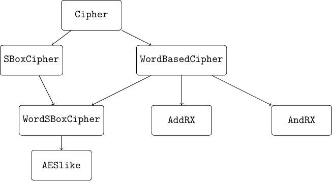

Implementing the Cipher
=======================

In CiVerLy, ciphers are implemented as Python (or more specifically sage) objects.
As different kinds of ciphers are suited differently well for the various modeling options, there is not only one cipher class in CiVerLy but a hierarchy as depicted below.

   The class hierarchy of CiVerLy ciphers.

The ``Cipher`` class is the base class for all ciphers in CiVerLy. It further supports the use of all components implemented in CiVerLy. However this versatility comes with the drawback that modeling ``Cipher`` objects with MILP is not supported, as the components performing modular addition and logical AND (``ModAdd_CVL`` and ``AND_CVL``, respectively) can only be modeled using SAT.
This is demonstrated with the code below.

.. code-block::

   # Four S-boxes in parallel followed by modular addition
   from civerly.component import *
   from civerly.cipher import Cipher
   from sage.crypto.sboxes import PRESENT
   ciph = Cipher(input_length=16, output_length=8, name="ciph")
   sb = SBox_CVL(PRESENT)
   modadd = ModAdd_CVL(word_length=8)
   nodes = []
   for j in range(4):
       nodes.append(
           ciph.add_subcipher(sb, [(ciph.IN, (i + 4*j, i)) for i in range(4)])
       )
   node_out = ciph.add_subcipher(
       modadd, [(nodes[i // 4], (i % 4, i)) for i in range(16)]
   )
   ciph.add_output([(node_out, (i, i)) for i in range(8)])

   # Modeling with MILP is not possible
   from civerly.model_options import *
   model_options = MODEL_OPTIONS(
       cryptanalysis=CRYPTANALYSIS.DIFFERENTIAL,
       optimization=OPTIMIZATION.MILP,
       granularity=GRANULARITY.BITWISE,
       sbox_modeling=SBOX_MODELING.CONVEX_HULL,
       solver=SOLVER.GLPK
   )
   ciph.model(model_options)
   # Causes an error:
   # NotImplementedError: MILP modeling is not supported for
   # <class 'civerly.cipher.Cipher'>!

Next, we differentiate between ciphers containing only S-boxes as non-linear components, which are captured by the ``SBoxCipher`` class and its subclasses, respectively.
We want to emphasize again that in contrast to SAT modeling, MILP modeling is only supported for instances of the ``SBoxCipher`` class and the classes inheriting from it, since ``SBox_CVL`` is the only non-linear component that may be modeled using MILP in CiVerLy.
Adding components which are not allowed causes an error directly when executing ``add_subcipher``:

.. code-block::

   from civerly.component import *
   from civerly.sboxcipher import SBoxCipher
   from sage.crypto.sboxes import PRESENT
   ciph = SBoxCipher(input_length=16, output_length=8, name="ciph")
   sb = SBox_CVL(PRESENT)
   modadd = ModAdd_CVL(word_length=8)

   # Causes an error:
   # TypeError: The passed sub_cipher has type
   # <class 'civerly.component.ModAdd_CVL'>
   # and is not allowed in SBoxCiphers.
   ciph.add_subcipher(modadd, [(ciph.IN, (i, i)) for i in range(16)])

   # In contrast, this works:
   ciph.add_subcipher(sb, [(ciph.IN, (i, i)) for i in range(4)])

We also differentiate between ciphers that come with a word structure and those that do not by introducing the ``WordBasedCipher`` class.
Here, all components that are added are required to have input and output sizes that are multiples of the word size specified upon initialization of the respective ``WordBasedCipher`` object.
This forms the base class of three different subclasses which, next to enforcing a fixed word size, specify the non-linear component they support.
Objects from the ``WordSBoxCipher`` class allow S-boxes, while ``AddRX`` and ``AndRX`` instances only allow modular addition and logical AND, respectively.
The two latter types of non-linear components are not supported in the MILP part of CiVerLy as there exist much more efficient SAT modeling techniques in the literature.
Therefore, the corresponding classes are solely meant to be used in the context of SAT modeling.
However using the ``WordSBoxCipher`` class enables the additional features regarding word-wise MILP modeling, while also supporting the bitwise methods introduced by the ``SBoxCipher`` parent class.

Finally, as the AES influenced the design of many symmetric primitives, we add a special class for such AESlike ciphers, which are required to operate on a rectangular state matrix while inheriting the properties of ``WordSBoxCipher`` objects.
Furthermore, linear layers implemented as ``LinearLayer_CVL`` objects are required to operate on columns, i.e. their input and output size must be equal to the ciphers word size times the number of rows in the ciphers state.
However this does not hold for ``PermuteLayer_CVL``, as these might resemble ShiftRows-like components which act on the entire state.
Furthermore, it is important to consider the inconsistent indexing in AES-like state arrays in the literature, where some ciphers such as Craft enumerate the words in a row-wise manner, while other ciphers such as the AES uses column-wise indexing.
Due to the importance of the AES in symmetric cryptography, we decided to employ column-wise indexing.
Therefore, those AES-like ciphers that use row-wise indexing need to be transposed before and after applying a similar permutation.

An important note is that generally, a cipher should be implemented as low in the hierarchy as possible as this maximizes the number of available model options.
For a concise summary of the class structure in CiVerLy see the table below.

.. list-table:: Summary of each ``Cipher`` subclass together with its supported components and allowed modeling techniques.
   :widths: 20 30 25 25
   :header-rows: 1
   :name: tab-class-overview

   * - Class
     - Components allowed
     - Modeling techniques (MILP)
     - Modeling techniques (SAT)
   * - ``Cipher``
     - All
     - \-
     - Bitwise
   * - ``SBoxCipher``
     - All except ``AND_CVL``, ``ModAdd_CVL``
     - Bitwise
     - Bitwise
   * - ``WordBasedCipher``
     - All with correct wordsize
     - \-
     - Bitwise
   * - ``WordSBoxCipher``
     - See ``WordBasedCipher`` and ``SBoxCipher``
     - Bitwise, Wordwise
     - Bitwise
   * - ``AndRX``
     - See ``WordBasedCipher``, except ``SBox_CVL``, ``ModAdd_CVL``
     - \-
     - Bitwise
   * - ``AddRX``
     - See ``WordBasedCipher``, except ``SBox_CVL``, ``AND_CVL``
     - \-
     - Bitwise
   * - ``AESlike``
     - See ``WordSBoxCipher``, only MixColumn-like ``LinearLayer_CVL``
     - Bitwise, Wordwise
     - Bitwise

To implement a cipher, we first initiate an empty instance of the corresponding cipher class.
Then, step by step, we add the sub-ciphers or components that make up the computational circuit of the cipher.
This is implemented with the ``add_subcipher`` method of the ``Cipher`` object which takes the component/sub-cipher and the origin of its inputs as parameters.
Conceptually, this means that we build a Directed Acyclic Graph (DAG) where each node is either a (sub-)cipher or a fundamental component and the edges describe the dataflow between these.
For a full list of the available components, we refer to the CiVerLy documentation.
Notice that there is a special node in the cipher that represents its inputs, which is inserted into the DAG upon initialization.
The last step of implementing a cipher is to declare its outputs which is done by using the ``add_output`` method. If not all outputs have been specified, the cipher is not considered to be finished and therefore can not be evaluated nor modeled.
Whether this is the case or not is indicated by the ``is_valid`` attribute, which is only set to True if all outputs have been specified.
Once we have finished implementing the cipher, we can evaluate it, e.g., to verify test vectors, by simply calling its ``eval`` method.

Key Schedules
-------------

CiVerLy supports attaching a key schedule to a cipher for correctness testing.
Calling :meth:`civerly.cipher.Cipher.set_master_key` derives the round keys
from a master key and injects them into the cipher's
``RoundkeyXOR_CVL`` nodes, so that ``eval`` produces the correct ciphertext
for a given key.

Note that the key schedule has **no effect on the MILP or SAT model** — round
key nodes are transparent pass-throughs in the cryptanalysis model and do not
influence the result.

To attach a key schedule to a cipher, two attributes must be set on the cipher
instance:

- ``cipher.key_schedule`` — a callable that takes the master key as an integer
  and returns a list of ``R+1`` round key integers (one per round key node).
- ``cipher._rk_components`` — an ordered list of the ``RoundkeyXOR_CVL`` nodes
  in the cipher DAG, matching the order of the round keys returned by
  ``key_schedule``.

The recommended approach is to implement the key schedule as a
:class:`civerly.keyschedule.KeySchedule` DAG using standard CiVerLy
components, which allows the key expansion itself to be verified for
correctness. Alternatively, any callable that returns round keys in the correct
list format is accepted, for example a plain Python function.

For complete reference implementations see:

- :mod:`civerly.cipher_implementations.aes` — ``AES_KeySchedule_CVL``
- :mod:`civerly.cipher_implementations.speck` — ``SPECK_KeySchedule_CVL``
